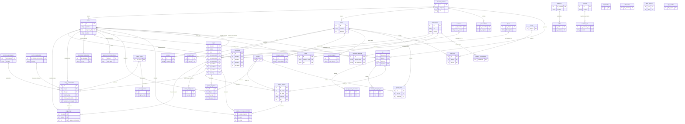

```mermaid
erDiagram
    buses {
        int id PK
        string patente
        int empresa_id FK
        string n_bus
    }
    
    razones_sociales {
        int id PK
        string empresa
        string rut
    }
    
    proveedores {
        int id_proovedor PK
        int id_empresa FK
    }

    conductores {
        int id PK
        string rut
        string nombre
    }

    auxiliares {
        int id_auxiliar PK
        string rut_auxiliar
    }
    
    boleteros {
        int id_boletero PK
        string nombre
    }

    bombero_encargado {
        int id_bombero PK
        string nombre
    }

    chofer_combustible {
        int id_chofer_combustible PK
        string nombre
    }

    rutas {
        int id PK
        string nombre
        int empresa FK
    }

    horarios_ruta {
        int id PK
        int ruta_id FK
    }
    
    horarios_buses {
        int id PK
        string ruta_horario FK
    }
    
    buses_traiguen {
        int id PK
        string ruta_horario FK
    }

    viajes {
        int id_viaje PK
        int id_bus FK
        int ruta FK 
        int id_conductor1 FK
        int id_conductor2 FK
        int id_conductor3 FK
        int id_auxiliar1 FK
        int id_auxiliar2 FK
        int id_auxiliar3 FK
        int id_carga FK
    }
    
    carga_combustible {
        int id PK
        int bus_id FK
        int id_viaje FK
        int region_carga FK
        int chofer_combustible FK
        int bombero_encargado FK
    }
    
    descarga_combustible {
        int id_descarga PK
        string n_bus FK
    }
    
    carga_viaje {
        int id_viaje FK
        int id_bus FK
        int id FK "carga_combustible"
    }

    region_carga {
        int id_region PK
    }

    precio_petroleo {
        int id PK
        int region_carga FK
    }

    consumos {
        int id PK
        int id_bus1 FK
        int id_bus2 FK
        int id_bus3 FK
        int id_objeto FK
    }

    objetos {
        int id_objeto PK
        string descripcion
    }
    
    gastos_mensuales_buses {
        int id_bus1 FK
        float total_gasto
    }

    sacel {
        int id PK
        string numero_flota FK
        string rut FK 
    }
    
    excesos_velocidad {
        int id PK
        string numero_flota FK
        string rut_conductor FK 
    }
    
    scania {
        int id PK
        string vehiculo FK 
    }

    peajes {
        int id PK
    }

    tsc {
        int id_tarjeta PK
        int id_bus FK
        string patente
        int empresa FK
    }
    
    peajes_raw_araucania {
        int id PK
        int tsc FK
    }
    
    peajes_raw_los_rios {
        int id PK
        int tsc FK
    }

    peajes_registro {
        int id PK
        int id_peaje FK
        int id_viaje FK
        string patente FK
        int tsc FK
    }
    
    peajes_registro2 {
        int id PK
        int id_bus FK
        int id_peaje FK
        int id_viaje FK
    }
    
    peajes_con_viaje_extendido {
        int id_peaje_registro FK
        int id_bus FK
        int id_viaje FK
    }

    peajes_ruta {
        int id PK
        int id_ruta FK
        int id_peaje FK
    }

    lozas {
        int id_losa PK
    }

    losa_ruta {
        int id PK
        int id_losa FK
        int id_ruta FK
    }
    
    sueldos_prorrateados {
        int conductor FK
    }

    ventas_agrupadas {
        int id PK
        int id_viaje FK
    }
    
    baños {
        int id_baño PK
        int id_boletero FK
    }
    
    usuarios {
        int id PK
        string nombre
    }
    
    custodia_cab {
        int id_custodia_cab PK
        string usuario FK
    }
    
    empleados {
        int id PK
    }
    
    almacenes {
        int id_almacen PK
    }
    
    taller_general {
        int a_o PK
        int mes PK
    }
    
    tipo_cambio {
        int id_registro PK
    }

    %% Relaciones Empresariales
    razones_sociales ||--o{ buses : "posee"
    razones_sociales ||--o{ rutas : "opera"
    razones_sociales ||--o{ proveedores : "contrata"
    razones_sociales ||--o{ tsc : "gestiona"
    
    %% Relaciones de Viajes y Vehículos
    buses ||--o{ viajes : "realiza"
    rutas ||--o{ viajes : "tiene"
    rutas ||--o{ horarios_ruta : "itinerario"
    rutas ||--o{ horarios_buses : "horarios web"
    rutas ||--o{ buses_traiguen : "buses web"
    
    conductores ||--o{ viajes : "conduce (1,2,3)"
    auxiliares ||--o{ viajes : "asiste en (1,2,3)"
    
    viajes ||--o{ carga_viaje : "tiene asociado"
    buses ||--o{ carga_viaje : "registra carga"
    carga_combustible ||--o{ carga_viaje : "enlaza con"
    
    viajes ||--o{ ventas_agrupadas : "tiene cortes de venta"
    
    %% Relaciones de Combustible y Compras Extra
    buses ||--o{ carga_combustible : "carga tanque"
    viajes ||--o{ carga_combustible : "asociada a"
    region_carga ||--o{ carga_combustible : "ocurre en"
    chofer_combustible ||--o{ carga_combustible : "mueve el estanque"
    bombero_encargado ||--o{ carga_combustible : "suministra"
    
    buses ||--o{ descarga_combustible : "vacía el tanque"
    
    region_carga ||--o{ precio_petroleo : "define precio"
    
    buses ||--o{ consumos : "requiere compra"
    objetos ||--o{ consumos : "se compone de"
    
    buses ||--o{ gastos_mensuales_buses : "acumula gastos"

    %% Relaciones de Peajes y Autopistas
    buses ||--o{ tsc : "porta dispositivo"
    tsc ||--o{ peajes_raw_araucania : "factura"
    tsc ||--o{ peajes_raw_los_rios : "factura"
    
    tsc ||--o{ peajes_registro : "cruza por"
    viajes ||--o{ peajes_registro : "atraviesa"
    peajes ||--o{ peajes_registro : "cobra en"
    
    viajes ||--o{ peajes_registro2 : "atraviesa"
    buses ||--o{ peajes_registro2 : "pasa por"
    peajes ||--o{ peajes_registro2 : "cobra en"

    peajes_registro ||--o{ peajes_con_viaje_extendido : "se retrasa"
    buses ||--o{ peajes_con_viaje_extendido : "afectado"
    viajes ||--o{ peajes_con_viaje_extendido : "afectado"

    rutas ||--o{ peajes_ruta : "incluye"
    peajes ||--o{ peajes_ruta : "está en"
    
    rutas ||--o{ losa_ruta : "incluye"
    lozas ||--o{ losa_ruta : "está en"
    
    %% Relaciones Telemetría y RRHH
    buses ||--o{ sacel : "marca ruta"
    conductores ||--o{ sacel : "ficha en"
    
    buses ||--o{ excesos_velocidad : "registra exceso"
    conductores ||--o{ excesos_velocidad : "comete exceso"
    
    buses ||--o{ scania : "vehiculo escaneado"
    conductores ||--o{ sueldos_prorrateados : "recibe saldo"
    
    %% Relaciones Menores
    boleteros ||--o{ baños : "administra"
    usuarios ||--o{ custodia_cab : "mantiene guardia de"
    
    %% Tablas estáticas o sin interconexión aparente directa que quedan flotando semánticamente
    %% empleados
    %% almacenes
    %% taller_general
    %% tipo_cambio

```
